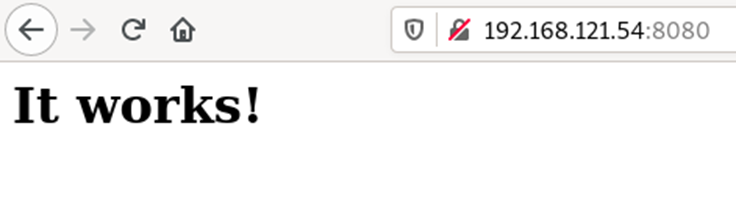

# **DOCKER**

Instalar paquete previamente.

Comandos utiles:

* Inicializar una imagen extraida desde docker hub:

  ```
  docker run -p 8080:80 wordpress 
  ```
* Listar imagenes:

  ```
  docker images
  ```
* Eliminar imagenes:

  ```
  docker rmi <tag:version>
  ```

  # **CONTENEDORES**
* Listar contenedores:

  ```
  docker container ls
  docker ps
  docker container list
  ```
* Listar contenedores ACTIVOS:

  ```
  docker ps --all o -a
  ```
* Iniciar un contenedor:

  ```
  docker container start <contenedor>
  ```
* Parar un contenedor:

  ```
  docker container stop <contenedor>
  ```
* Eliminar contenedor:

  ```
  docker container rm <contenedor>
  ```

# **CREACIÓN DE SERVIDOR WEB**

* Crear servicio a deployar:

  ```
  docker run -d --name my-apache-app -p 8080:80 httpd:2.4
  ```
* Probar desde el navegador:

  
